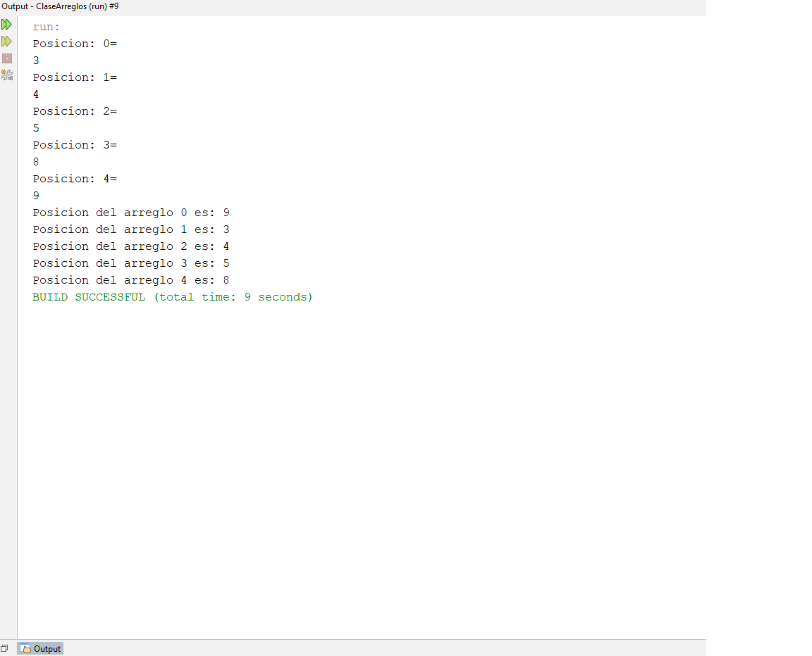
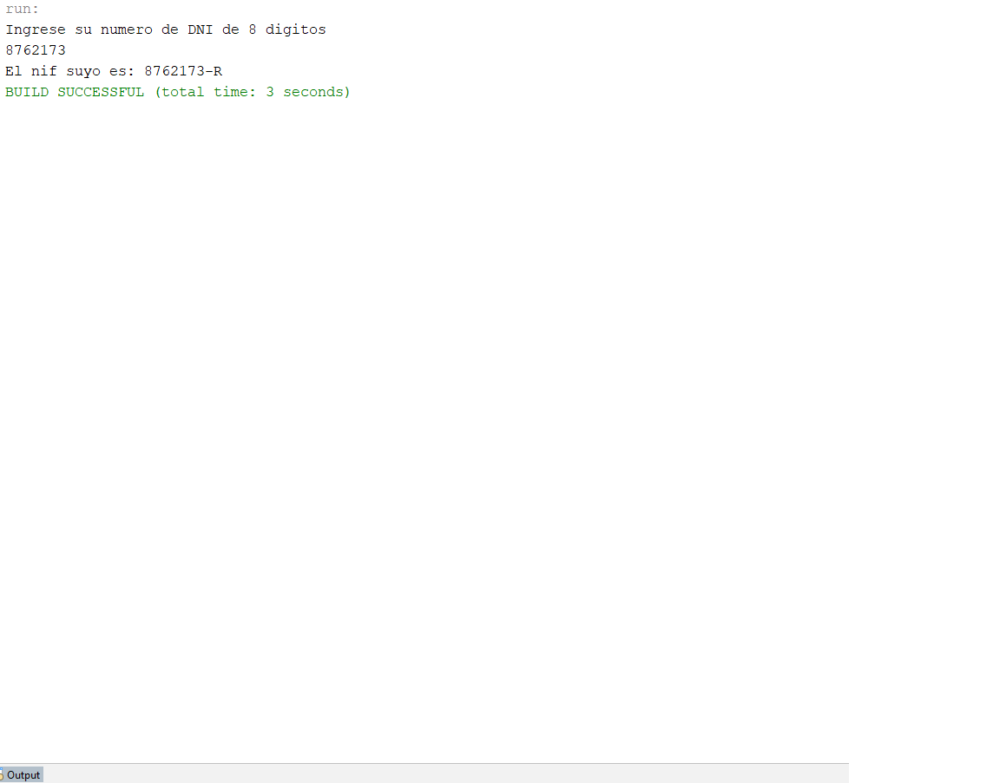
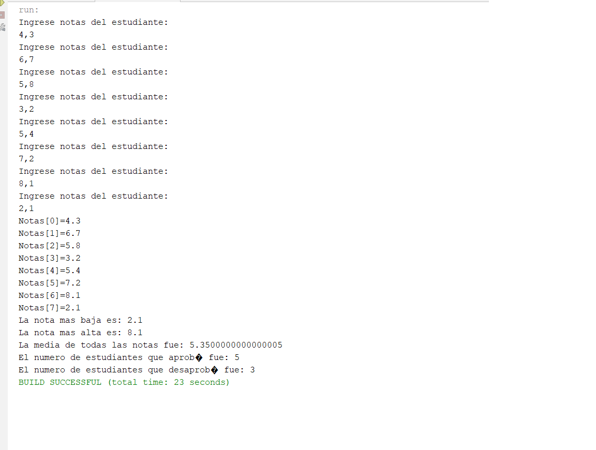
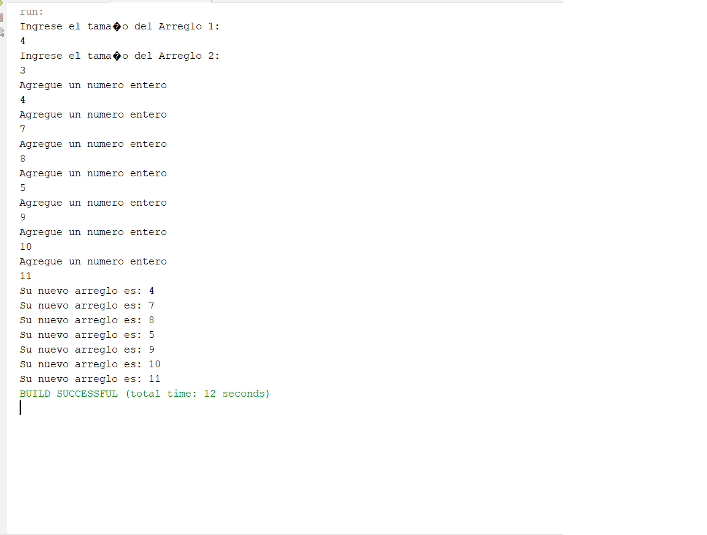
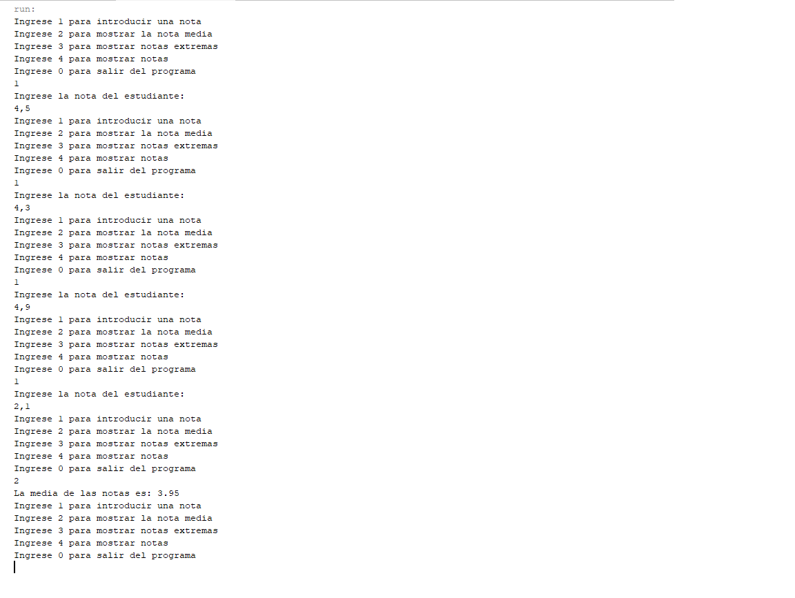
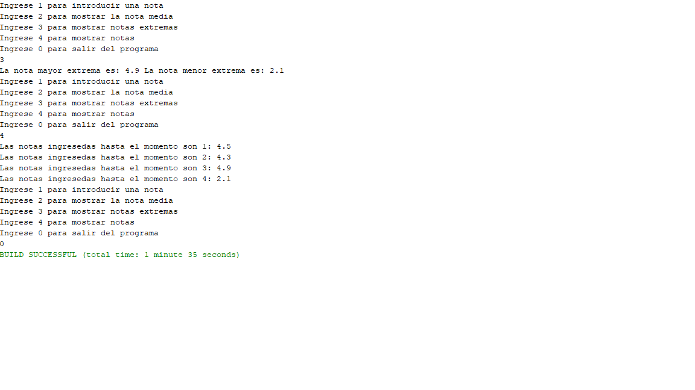
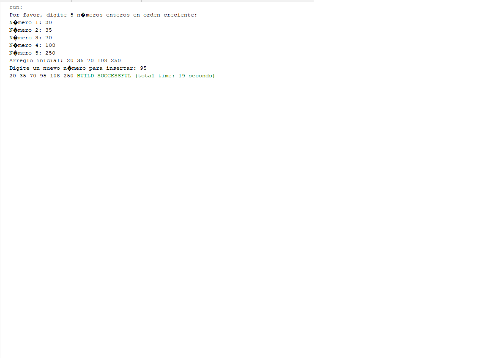
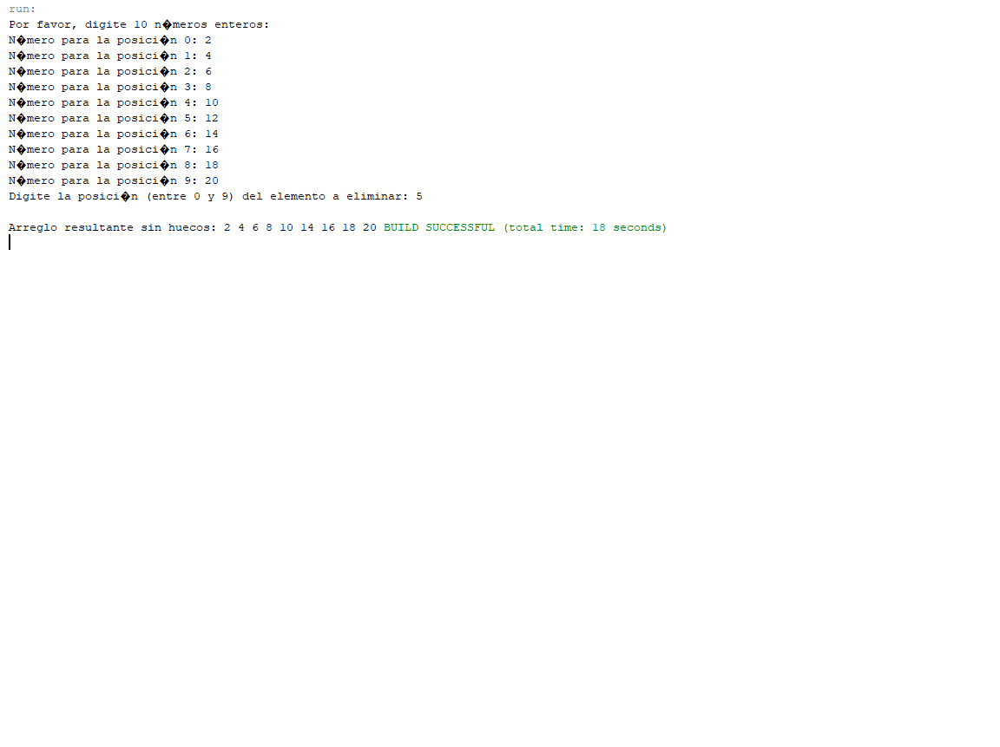

# Markdown Cheat Sheet (Example File)

This is a **generic Markdown template** showcasing essential formatting features.

---

## 1. Ejercicios Arreglos

---

## 2. Información Del Estudiante:
**Nombre Completo:** Danny Nicolás Gutiérrez Mejía
**Programa Académico:** Tecnología en Desarrollo de Software
**Fecha de Entrega:** 17/09/2026
---

## 3. Evidencias
- Captura de pantalla de los ejercicios:
### Ejercicio 1
>Escribe un programa que lea 5 números por teclado y que los almacene en un array. Rota los
elementos de ese array, es decir, el elemento de la posición 0 debe pasar a la posición 1, el de la 1 a la
2, etc. El número que se encuentra en la última posición debe pasar a la posición 0. Finalmente,
muestra el contenido del array.

### Ejercicio 2
>Escribir un programa que sea capaz de calcular la letra de un NIF a partir del número del DNI. El
programa debe pedir al usuario el DNI de 8 dígitos y posteriormente calculará la letra del NIF (se
pueden añadir métodos para aislar las tareas, si se conoce el trabajo con métodos). Al finalizar el
programa se debe presentar el NIF completo con el formato: ocho dígitos, un guion y la letra en
mayúscula; por ejemplo: 00395469-F.

### Ejercicio 3
>Pedir por teclado las notas de 8 estudiantes y guardarlas en un array de notas. Las notas serán números
decimales. Tras leer las notas en un bucle inicial, procesar en otro bucle la información y mostrar por
pantalla:
1. la nota más alta
2. la nota más baja
3. la nota media de todas las notas
4. el número de aprobados
5. el número de suspensos

### Ejercicio 4
>Escribir un programa en el que se pidan al usuario por teclado los valores de dos arrays de números
enteros llamados arr1 y arr2, y luego se construya un nuevo array resultado de “concatenar” los arrays
arr1 y arr2, es decir, poner los elementos de arr2 a continuación de los de arr1. Finalmente, se escriban
en pantalla todos los elementos del nuevo array.

### Ejercicio 5
>Hacer un programa que muestre un menú de este tipo:

"1.- Introducir nota"
"2.- Mostrar nota media"
"3.- Mostrar notas extremas"
"4.- Mostrar notas"
"0.- Salir"
De modo que si se opta por:
✤ la opción 1 pide por teclado una nueva nota, y se guarda en un array
✤ la opción 2 muestra la nota media de todas las introducidas hasta ese momento
✤ la opción 3 muestra la menor y la mayor de todas las notas introducidas hasta ese momento
✤ la opción 4 muestra todas las notas introducidas hasta ese momento
✤ la opción 0 acaba el programa

### Ejercicio 6
>Pedir 5 enteros por teclado (se supone que se introducen ordenados de forma creciente). Los números
los guardaremos en un array de tamaño 6. Imprimir el array. Pedir un nuevo número (que debe estar
entre los números antes introducidos) e insertarlo en el lugar adecuado para que el array continúe
ordenado. Imprimir el nuevo array resultante.

### Ejercicio 6
>Realizar un programa que lea por teclado un array de 10 elementos numéricos enteros y una posición
(entre 0 y 9). Eliminar el elemento situado en la posición dada sin dejar huecos.

## Conclusiones
La verdad profe demasiado complicado lo de arreglos, eso está muy dificil...

    }
}
